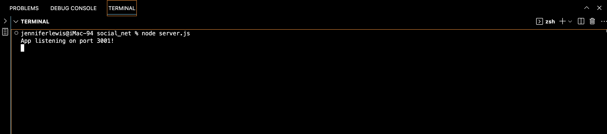
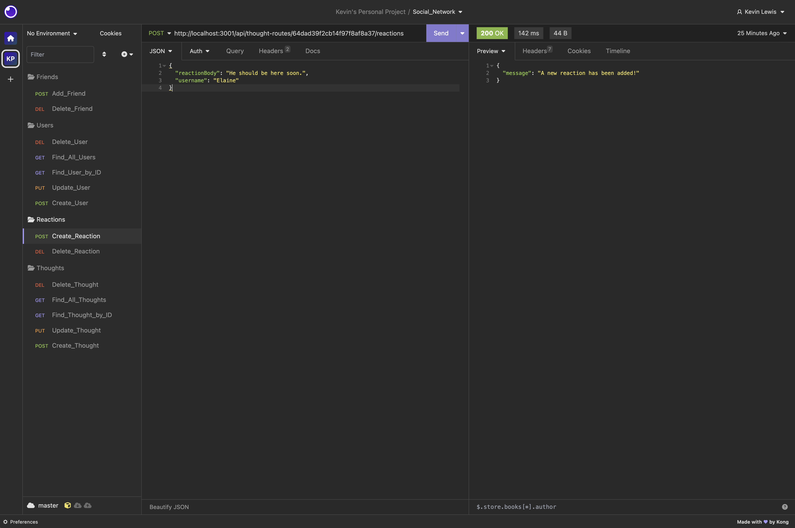
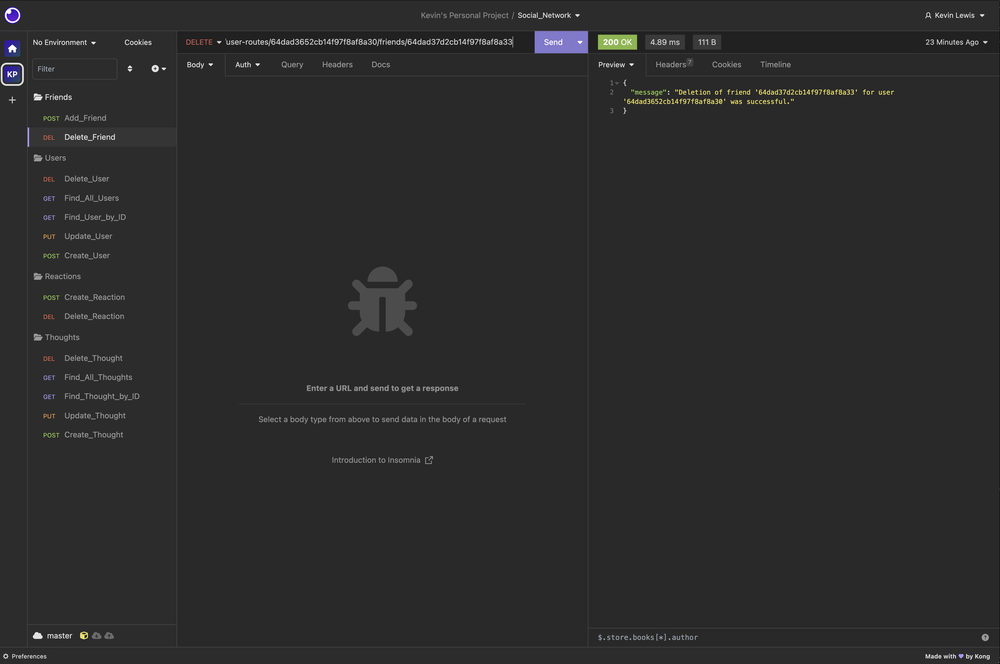

# ***Social Network utilizing Mongoose***

 

## Overview
This simple command-line application allows users to create usernames and then comment and react to comments on a small-scale social network. Users are also able to edit and delete comments, as well as "friend" and "un-friend" each other.
 

## Application Set-Up
1) To get started, download this repo and in your terminal, from the root folder run... 
• `npm i` (to install the "Node Package Module" itself) 
  • `npm i mongoose` 
  • `npm i express` 

2) Once the dependencies have been installed, use control-C or otherwise terminate operations and close this terminal.

3) Open a new terminal from your root directory and run `node server.js`. You should see the message ***"App listening on port 3001!"*** in your terminal.

## Application Instructions
To interact with the database, open an API client (Insomnia or similar) and enter http://localhost:3001/ followed by the end points detailed in the "user-routes.js" and "thought-routes.js" files, within the "routes/api-routes" folder". 
  • There is no "seed data", so feel free to create new "Users" and "Thoughts" (via "POST" request to the proper endpoints). 
  • You may now retrieve data (send a "GET" query on) **ALL** "Users" or "Thoughts", via the proper endpoints. 
  • "Users" have the ability to "friend" other users, by sending a "POST" to the proper endpoint for such actions. "Friends" are tracked and counted. "Users" may also remove "friends", via a "DELETE" route. 
  • "Users" have the ability to "React" to "Thoughts", by sending a "POST" to the proper endpoint for such actions. "Reactions" to a "Thought" are tracked and counted. "Users" may also remove "Thoughts" and "Reactions", via a "DELETE" route. 
  ***Please note: Deleted data cannot be retrieved.***

 

## Static Screen-Captures of the Application

##

##

##

 

## Application Demo Video

 

## Contributors To This Application
Kevin Lewis

 

# ***Thank you for using this App!***

 

## Questions? Contact the Developer on GitHub... 
KPL33
## ...or via Email
kevinsname2003@yahoo.com